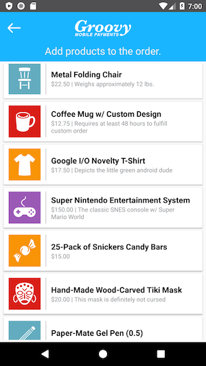
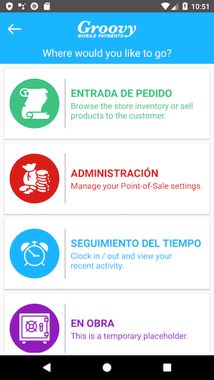
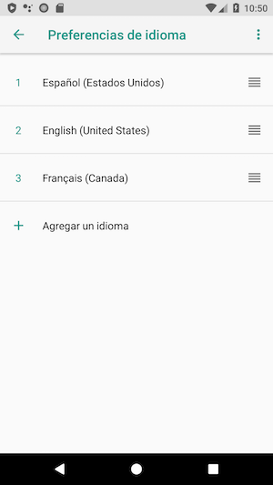

# SkeletonPaymentApp-Senior
Just a skeleton shell app with lots of method stubs and possibly even intentional compiler errors.

## This App is intended for Senior candidates.
There are Android and iOS variants of this mobile payment app in the respective directories.

Login Screen                                             | Main Dashboard
:-------------------------------------------------------:|:---------------------------------------------------------:
 | 

| Order Entry | Under Construction |
| :---: | :---: |
 | 

# Useful References

### Game-Icons.net  
Many thanks to the contributors and maintainers over at game-icons.net - it has been an extremely helpful resource in prototyping mobile applications.  
https://game-icons.net  

### Stripe
https://stripe.com/docs/development  

### Retrofit
https://square.github.io/retrofit  

### Gson
https://github.com/google/gson  

## Core Project Dependencies

```
// Google Gson
implementation 'com.google.code.gson:gson:2.8.5'

// Square Retrofit HTTP Library - https://square.github.io/retrofit/
implementation 'com.squareup.retrofit2:retrofit:2.5.0'
implementation 'com.squareup.retrofit2:converter-gson:2.5.0'
implementation 'com.squareup.okhttp3:okhttp:3.12.0'
implementation 'com.squareup.okhttp3:logging-interceptor:3.11.0'
```

## AOSP Java Code Style Guidelines
* Consistency  
* Readability  
* Well-Organized  
* Self-Documenting Code  
* Appropriate Use of Annotations  
* Use / Address Analyzer Warnings  
https://source.android.com/setup/contribute/code-style  

## Git Workflow References

Useful git commands for quickly traversing repos:  
```
# Pushing from a local repository to GitHub hosted remote
git remote add origin git@github.com:USERNAME/REPO-NAME.git

# Clone your fork to your local machine
git clone git@github.com:USERNAME/FORKED-PROJECT.git
```

## GitHub Standard Fork & Pull Request Workflow  
Useful link about project forks:
https://gist.github.com/Chaser324/ce0505fbed06b947d962  

# Business Requirements Document (BRD)  

## Task ID: #001 - Main Dashboard Crash  
#### Estimated LOE (Level of Effort): 2 Hours  

[//]: # (Line breaks must be added to control text wrapping for multi-line rows, otherwise the image will get squashed)

| Requirements | Business Mock |
| :--- | --- |
| The application currently **crashes** when a `Placeholder` button is clicked on the<br>main dashboard.<br><br>Design an alert dialog that is shown with an `"Under Construction"` type of message<br>instead of crashing. |  |

## Task ID: #002 - Product List Facelift  
#### Estimated LOE (Level of Effort): 2 Hours  

| Requirements | Business Mock |
| :--- | --- |
| Users of this application have complained that the Product list looks very bland.<br><br>Update the style of the products to match this mock as closely as possible (or use<br>your creativity to implement a better design). |  |

## Task ID: #003 - Language Translation of Your Choice
#### Estimated LOE (Level of Effort): 3 Hours  

| Requirements | Business Mock |
| :--- | --- |
| Google Play Store users have left us lots of negative feedback because the application<br>only supports English and Spanish.<br><br>For this task, localize all of the app's string resources to another language<br>of your choice. Go through the app and extract any hard-coded strings as necessary.<br><br>**You do not need to worry about the names and descriptions of database entities.** |  |
| The system language can be changed at Runtime under System settings. |  |
