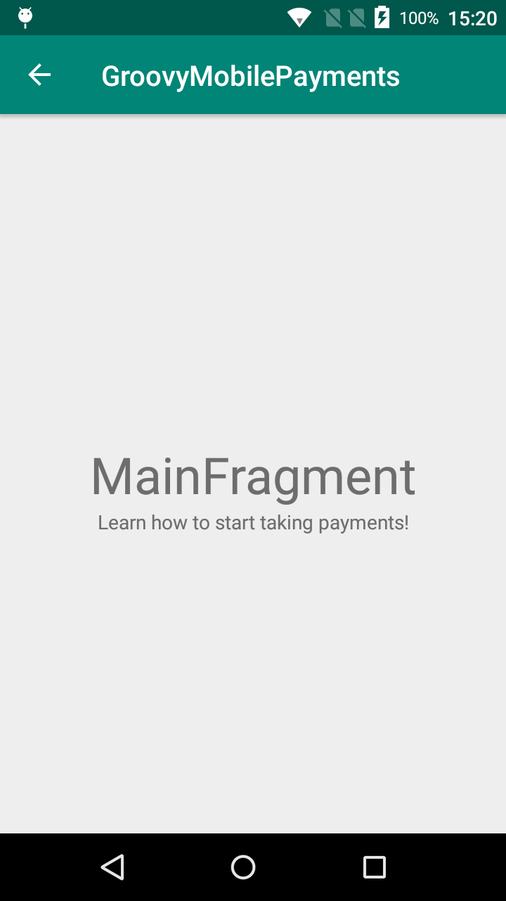

# SkeletonPaymentApp-Senior
Just a skeleton shell app with lots of method stubs and possibly even intentional compiler errors.

## This App is intended for Senior candidates. 
There are Android and iOS variants of this mobile payment app in the respective directories.

Login Screen                                             | Main Activity
:-------------------------------------------------------:|:---------------------------------------------------------:
 | 

# Useful References

### Stripe
https://stripe.com/docs/development  

### Retrofit
https://square.github.io/retrofit  

### Gson
https://github.com/google/gson  

## Core Project Dependencies

```
// Google Gson
implementation 'com.google.code.gson:gson:2.8.5'

// Square Retrofit HTTP Library - https://square.github.io/retrofit/
implementation 'com.squareup.retrofit2:retrofit:2.5.0'
implementation 'com.squareup.retrofit2:converter-gson:2.5.0'
implementation 'com.squareup.okhttp3:okhttp:3.12.0'
implementation 'com.squareup.okhttp3:logging-interceptor:3.11.0'
```

## AOSP Java Code Style Guidelines
* Consistency  
* Readability  
* Well-Organized  
* Self-Documenting Code  
* Appropriate Use of Annotations  
* Use / Address Analyzer Warnings  
https://source.android.com/setup/contribute/code-style  

## Git Workflow References

Useful git commands for quickly traversing repos:  
```
# Pushing from a local repository to GitHub hosted remote
git remote add origin git@github.com:USERNAME/REPO-NAME.git

# Clone your fork to your local machine
git clone git@github.com:USERNAME/FORKED-PROJECT.git
```

## GitHub Standard Fork & Pull Request Workflow  
Useful link about project forks:
https://gist.github.com/Chaser324/ce0505fbed06b947d962  

# Business Requirements Document (BRD)  

```
// TODO: Add requirements / screen mocks
```
